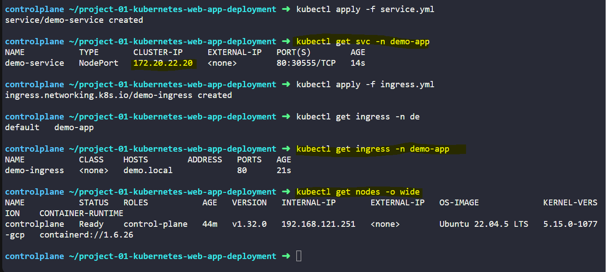

# Project Artifacts

Below are the Kubernetes YAMLs and test outputs used in this project along with visual evidence of their creation and behavior.

---

## 1. Namespace

---

## 2. ConfigMap

---

## 3. Secret

---

## 4. Deployment

---

## 5. Ingress

---

## 6. Port Forward and Curl Test

---

## 7. Curl localhost:8080 Success

